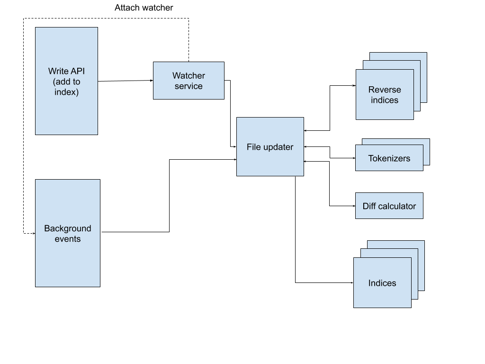

# QLucene

An in-house engine to index and search for terms in given files.

### Table of contents

- [What is QLucene?](#what-is-qlucene)
- [System requirements](#system-requirements)
- [How do I run it?](#how-do-i-run-it)
- [How do I use it?](#how-do-i-use-it)
- [High-level system overview](#high-level-system-overview)    
- [Supported file formats](#supported-and-tested-file-formats)
- [Good to know](#good-to-know)

### What is QLucene?
QLucene is an indexing and searching library. Its API allows adding directories and files to the index, and later searching
for the files which contain the given term. It monitors files and directories which had been added to index and updates the index
if the former are changed.

In particular, current implementation provides the following functionality:
* adding files or directories to index. Directories are added recursively, that means, adding top-level directory results in nested directories
also being tracked - with a limitation of depth configurable by `directory.index.max-depth` parameter of `search.properties`;
* searching for files by given words or sentences;
* when a previously added to index file or directory is changed (e.g. any file content change, or addition/removal of file/directory), corresponding
changes get propagated to index;
* concurrent searches/updates are supported.

As for non-functional limitations, files up to 10 MB in size will be indexed. Maximum number of simultaneously monitored files
depends on inotify limit. 

### System requirements
* JDK 11+

### How do I run it?
#### Build a .jar
 ```
 ./gradlew build
```
#### Include resulting .jar in your application
* location is `build/libs/qlucene-0.0.1-SNAPSHOT.jar`
    
> Make sure you have JDK 11 or higher on path to build the .jar.
    
### How do I use it?
`UserAPI.kt` has the API exposed. You can check there for exact operations and input parameters which are expected. 
### High-level system overview
Main pieces of this library are the following:
* Term (file `Term.kt` and descendants). Term, also token, is a basic thing which you would like to search by. E.g. you can search by a word, a sentence, or by annotation, or anything else.
* Tokenizer (file `Tokenizer.kt` and descendants). Tokenizer implements the way of splitting given file into `Term`s.  
* Index (file `Index.kt` and descendants). Every index is a storage of corresponding terms and the docs where the terms are mentioned. 

Ideally, to extend the library and add a new index, implementing corresponding instances of the 3 classes above should be sufficient. Still, please find below a generic overview of read and write flows.

Read (searching) flow


Write (indexing and re-indexing) flow


### Supported and tested file formats
See `file.supported-extensions` property in `search.properties`.

### Good to know
* Background monitoring is made with built-in Java library, where events come with delay up to a minute. Therefore:
    * please allow for up to a minute between modifying contents of monitored files and checking the visibility in index
    * integration tests checking background updates are disabled by default, they can be enabled with `-Dtest.profile=integration` build variable. Build time
    takes much more with it.
* the maximum number of files returned on search request is configurable with `reducer.size-based.max-size` parameter of `search.properties`
* the maximum depth when recursively registering directories is configurable by `directory.index.max-depth` parameter of `search.properties`
* deletion of root monitored directory itself is not supported. Inner directories and files of monitored directory can be deleted,
and the system will track it properly. However, if the directory itself which has been added to index directly is deleted, the behavior is 
 unspecified.